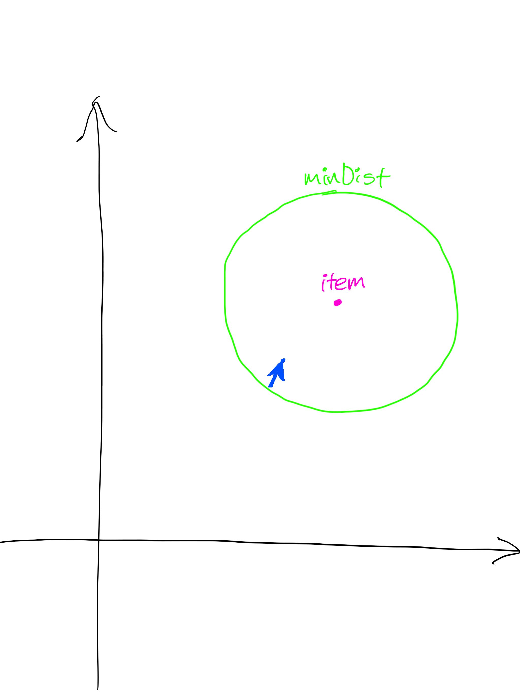
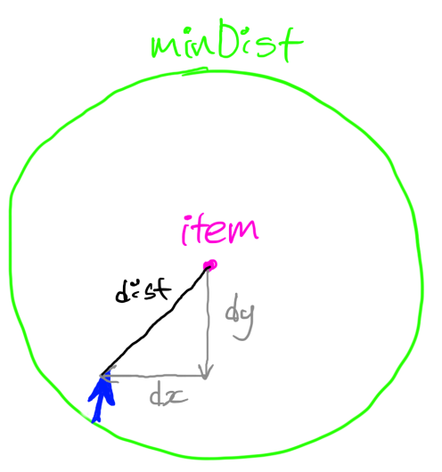
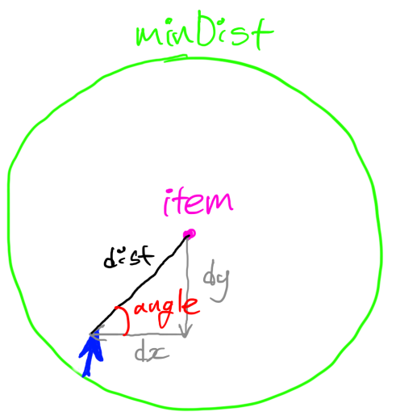
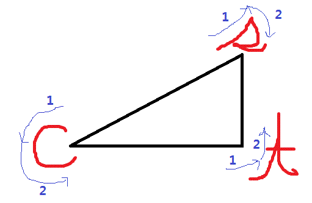
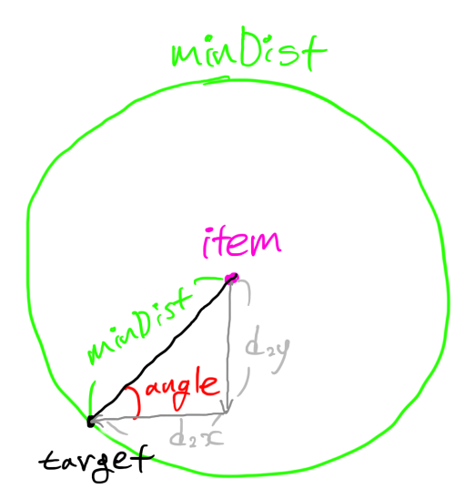
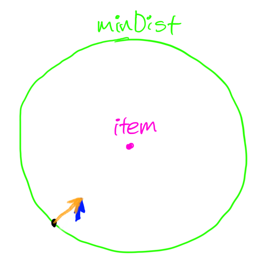
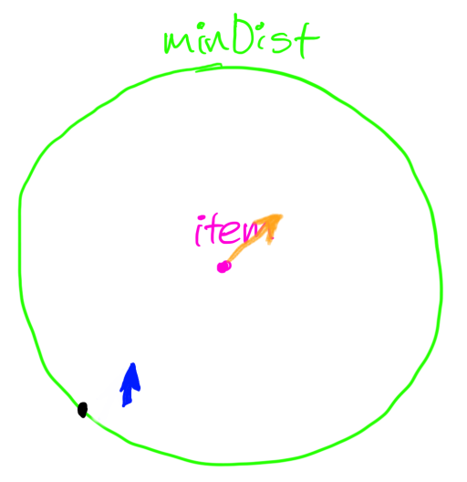

# Kinetic Typography

[미리보기](https://amoong.github.io/Kinetic-Typography/)

### 파티클의 속도 설정

```javascript
class Visual {
  ...
  ...

  animate() {
    const item = this.particle;

    const dx = this.mouse.x - item.x;
    const dy = this.mouse.y - item.y;
    const dist = Math.sqrt(dx * dx + dy * dy);

    const minDist = item.radius + this.mouse.radius;

    if (dist < minDist) {
      const angle = Math.atan2(dy, dx);
      const tx = item.x + Math.cos(angle) * minDist;
      const ty = item.y + Math.sin(angle) * minDist;

      const ax = this.mouse.x - tx;
      const ay = this.mouse.y - ty;

      item.vx += ax;
      item.vy += ay;

      item.collide();
    }

    item.draw();
  }
}
```

### 파티클의 위치 계산

```javascript
class Particle {
  ...
  ...

  draw() {
    this.rgb += (this.savedRgb - this.rgb) * COLOR_SPEED;

    this.x += (this.savedX - this.x) * MOVE_SPEED;
    this.y += (this.savedY - this.y) * MOVE_SPEED;

    this.vx *= FRICTION;
    this.vy *= FRICTION;

    this.x += this.vx;
    this.y += this.vy;

    this.sprite.x = this.x;
    this.sprite.y = this.y;
    this.sprite.tint = this.rgb;
  }
}
```

---

#### 파티클의 속도 설정 코드 분석

##### 마우스와 파티클 간의 거리가 `minDist` 보다 가까운 경우에 대하여



```javascript
animate() {
  const item = this.particle;

  const dx = this.mouse.x - item.x;
  const dy = this.mouse.y - item.y;
  const dist = Math.sqrt(dx * dx + dy * dy);

  const minDist = item.radius + this.mouse.radius;

  if (dist < minDist) {
    const angle = Math.atan2(dy, dx);
    const tx = item.x + Math.cos(angle) * minDist;
    const ty = item.y + Math.sin(angle) * minDist;

    const ax = this.mouse.x - tx;
    const ay = this.mouse.y - ty;

    item.vx += ax;
    item.vy += ay;

    item.collide();
  }

  item.draw();
}
```

---

1. 마우스가 `minDist` 경계 안쪽인지 체크



```javascript
const item = this.particle;

const dx = this.mouse.x - item.x;
const dy = this.mouse.y - item.y;
const dist = Math.sqrt(dx * dx + dy * dy);

const minDist = item.radius + this.mouse.radius;

if (dist < minDist) {
  ...
}
```

---

2. 마우스 파티클 두 점 사이의 각도 구하기



```javascript
const angle = Math.atan2(dy, dx);
```



---

3. `tx`, `ty`의 좌표 구하기 (t = target)



```javascript
const angle = Math.atan2(dy, dx);
const tx = item.x + Math.cos(angle) * minDist; // item.x + d2x
const ty = item.y + Math.sin(angle) * minDist; // item.y + d2y
```

---

4. target -> 마우스 벡터(가속도 - acceleration) 구하기


```javascript
const ax = this.mouse.x - tx;
const ay = this.mouse.y - ty;
```

---

5. 가속도를 파티클의 속도에 적용





```javascript
item.vx += ax;
item.vy += ay;

item.draw();
```

```javascript
const FRICTION = 0.98;
const COLOR_SPEED = 0.12;
const MOVE_SPEED = 0.88;

draw() {
  this.rgb += (this.savedRgb - this.rgb) * COLOR_SPEED;

  this.x += (this.savedX - this.x) * MOVE_SPEED;
  this.y += (this.savedY - this.y) * MOVE_SPEED;

  this.vx *= FRICTION;
  this.vy *= FRICTION;

  this.x += this.vx;
  this.y += this.vy;

  this.sprite.x = this.x;
  this.sprite.y = this.y;
  this.sprite.tint = this.rgb;
}
```

코드 출처: https://youtu.be/pJJQZvS9VNI
